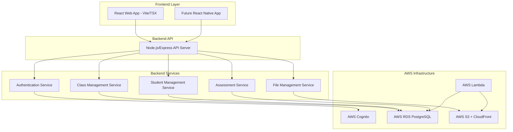

# Design Document

## Overview

This design outlines the migration of the ClassBoard application from a frontend-only React application with mock data to a full-stack solution with a robust backend API and AWS cloud services. The migration will be gradual, maintaining existing functionality while building and integrating new backend services.

The current application has well-structured TypeScript interfaces and a comprehensive data context that manages Classes, Students, Schedules, Tests, Attendance, Meetings, and Homework. These existing structures will serve as the foundation for the backend data models.

## Architecture

### High-Level Architecture



### Migration Strategy

1. **Phase 1**: Set up separate Node.js/Express backend API alongside existing React frontend
2. **Phase 2**: Implement AWS infrastructure (RDS, S3, Cognito)
3. **Phase 3**: Create backend services and API endpoints
4. **Phase 4**: Gradually migrate frontend to use API endpoints
5. **Phase 5**: Remove mock data and complete migration

## Components and Interfaces

### Database Schema Design

Based on the existing TypeScript interfaces, the PostgreSQL database will have the following main tables:

#### Core Tables

**users**
- id (UUID, Primary Key)
- email (VARCHAR, UNIQUE)
- name (VARCHAR)
- role (ENUM: 'teacher', 'admin')
- cognito_user_id (VARCHAR, UNIQUE)
- created_at (TIMESTAMP)
- updated_at (TIMESTAMP)

**students**
- id (UUID, Primary Key)
- name (VARCHAR)
- email (VARCHAR)
- phone (VARCHAR)
- grade (VARCHAR)
- parent_contact (VARCHAR)
- enrollment_date (DATE)
- created_at (TIMESTAMP)
- updated_at (TIMESTAMP)

**classes**
- id (UUID, Primary Key)
- name (VARCHAR)
- subject (VARCHAR)
- description (TEXT)
- room (VARCHAR)
- capacity (INTEGER)
- color (VARCHAR)
- created_date (DATE)
- created_at (TIMESTAMP)
- updated_at (TIMESTAMP)

**class_enrollments**
- id (UUID, Primary Key)
- class_id (UUID, Foreign Key → classes.id)
- student_id (UUID, Foreign Key → students.id)
- enrolled_at (TIMESTAMP)

#### Schedule Tables

**schedules**
- id (UUID, Primary Key)
- class_id (UUID, Foreign Key → classes.id)
- day_of_week (INTEGER) -- 0=Sunday, 1=Monday, etc.
- start_time (TIME)
- end_time (TIME)
- created_at (TIMESTAMP)

**schedule_exceptions**
- id (UUID, Primary Key)
- schedule_id (UUID, Foreign Key → schedules.id)
- date (DATE)
- start_time (TIME)
- end_time (TIME)
- cancelled (BOOLEAN)
- created_date (DATE)
- created_at (TIMESTAMP)

#### Assessment Tables

**tests**
- id (UUID, Primary Key)
- class_id (UUID, Foreign Key → classes.id)
- title (VARCHAR)
- description (TEXT)
- test_date (DATE)
- total_points (INTEGER)
- test_type (ENUM: 'quiz', 'exam', 'assignment', 'project')
- file_name (VARCHAR)
- file_url (VARCHAR)
- created_date (DATE)
- updated_date (DATE)
- created_at (TIMESTAMP)
- updated_at (TIMESTAMP)

**test_results**
- id (UUID, Primary Key)
- test_id (UUID, Foreign Key → tests.id)
- student_id (UUID, Foreign Key → students.id)
- score (INTEGER)
- max_score (INTEGER)
- percentage (DECIMAL)
- grade (VARCHAR)
- feedback (TEXT)
- submitted_date (DATE)
- graded_date (DATE)
- created_date (DATE)
- updated_date (DATE)
- created_at (TIMESTAMP)
- updated_at (TIMESTAMP)

#### Additional Tables

**homework_assignments**, **homework_submissions**, **meetings**, **attendance_records**, **class_notes** following similar patterns.

### API Endpoints Design

#### Authentication Endpoints
- `POST /api/auth/login` - Login with Cognito
- `POST /api/auth/logout` - Logout
- `GET /api/auth/me` - Get current user info
- `POST /api/auth/refresh` - Refresh JWT token

#### Class Management Endpoints
- `GET /api/classes` - List all classes
- `POST /api/classes` - Create new class
- `GET /api/classes/:id` - Get class details
- `PUT /api/classes/:id` - Update class
- `DELETE /api/classes/:id` - Delete class
- `POST /api/classes/:id/enroll` - Enroll student
- `DELETE /api/classes/:id/students/:studentId` - Unenroll student

#### Student Management Endpoints
- `GET /api/students` - List all students
- `POST /api/students` - Create new student
- `GET /api/students/:id` - Get student details
- `PUT /api/students/:id` - Update student
- `DELETE /api/students/:id` - Delete student

#### Assessment Endpoints
- `GET /api/classes/:classId/tests` - List tests for class
- `POST /api/classes/:classId/tests` - Create new test
- `GET /api/tests/:id` - Get test details
- `PUT /api/tests/:id` - Update test
- `DELETE /api/tests/:id` - Delete test
- `GET /api/tests/:id/results` - Get test results
- `POST /api/tests/:id/results` - Submit test result

#### File Management Endpoints
- `POST /api/files/upload` - Upload file to S3
- `GET /api/files/:id` - Get file metadata
- `DELETE /api/files/:id` - Delete file

### Frontend Integration

The existing React/Vite frontend will remain unchanged in terms of build system and component structure. Only the data layer will be updated:

#### Current Architecture
```
React Components → AppDataContext (mock data) → localStorage
```

#### New Architecture
```
React Components → AppDataService → Express API → Database/AWS
```

The `AppDataContext` will be gradually replaced with `AppDataService` that makes HTTP requests to the Express backend.

### Service Layer Architecture

#### AppDataService
Replaces the current `AppDataContext` with API calls:
```typescript
class AppDataService {
  async getClasses(): Promise<Class[]>
  async createClass(classData: CreateClassRequest): Promise<Class>
  async updateClass(id: string, updates: UpdateClassRequest): Promise<Class>
  async deleteClass(id: string): Promise<void>
  // ... other methods
}
```

#### AuthService
Handles Cognito integration:
```typescript
class AuthService {
  async login(email: string, password: string): Promise<AuthResult>
  async logout(): Promise<void>
  async getCurrentUser(): Promise<User | null>
  async refreshToken(): Promise<string>
}
```

## Data Models

### Request/Response Types

The existing TypeScript interfaces will be adapted for API communication:

```typescript
// API Request Types
interface CreateClassRequest {
  name: string
  subject: string
  description: string
  room: string
  capacity: number
  color: string
}

interface UpdateClassRequest extends Partial<CreateClassRequest> {}

// API Response Types
interface ApiResponse<T> {
  success: boolean
  data?: T
  error?: string
  message?: string
}

interface PaginatedResponse<T> {
  success: boolean
  data: T[]
  pagination: {
    page: number
    limit: number
    total: number
    totalPages: number
  }
}
```

### Database Models

Using an ORM like Prisma or TypeORM, the database models will mirror the existing interfaces:

```typescript
// Example Prisma schema
model Class {
  id              String   @id @default(uuid())
  name            String
  subject         String
  description     String
  room            String
  capacity        Int
  color           String
  createdDate     DateTime @map("created_date")
  createdAt       DateTime @default(now()) @map("created_at")
  updatedAt       DateTime @updatedAt @map("updated_at")
  
  // Relations
  enrollments     ClassEnrollment[]
  schedules       Schedule[]
  tests           Test[]
  attendanceRecords AttendanceRecord[]
  classNotes      ClassNote[]
  homeworkAssignments HomeworkAssignment[]
  
  @@map("classes")
}
```

## Error Handling

### API Error Response Format
```typescript
interface ApiError {
  success: false
  error: {
    code: string
    message: string
    details?: any
  }
  timestamp: string
  path: string
}
```

### Error Categories
- **Authentication Errors** (401): Invalid credentials, expired tokens
- **Authorization Errors** (403): Insufficient permissions
- **Validation Errors** (400): Invalid input data
- **Not Found Errors** (404): Resource not found
- **Server Errors** (500): Database errors, AWS service errors

### Frontend Error Handling
- Implement error boundaries for React components
- Show user-friendly error messages with toast notifications
- Implement retry mechanisms for transient failures
- Graceful degradation when API is unavailable

## Testing Strategy

### Backend Testing
1. **Unit Tests**: Test individual service methods and utilities
2. **Integration Tests**: Test API endpoints with test database
3. **Database Tests**: Test database operations and migrations
4. **AWS Integration Tests**: Test S3 uploads, Cognito authentication

### Frontend Testing
1. **Component Tests**: Test React components with mocked API calls
2. **Integration Tests**: Test complete user flows with API integration
3. **E2E Tests**: Test critical paths with Cypress or Playwright

### Migration Testing
1. **Data Migration Tests**: Verify data integrity during migration
2. **Backward Compatibility Tests**: Ensure existing features work during transition
3. **Performance Tests**: Compare response times between mock data and API

### Test Data Management
- Use factories for generating test data
- Implement database seeding for consistent test environments
- Use separate test databases for different test suites

## AWS Infrastructure Configuration

### RDS PostgreSQL Setup
- Multi-AZ deployment for high availability
- Automated backups with 7-day retention
- Performance Insights enabled
- Connection pooling with RDS Proxy

### S3 and CloudFront Configuration
- S3 bucket with versioning enabled
- CloudFront distribution for global CDN
- Signed URLs for secure file access
- Lifecycle policies for cost optimization

### Cognito Configuration
- User pool with email verification
- App client for web application
- Custom attributes for user roles
- MFA optional for enhanced security

### Lambda Functions
- Grade calculation functions
- Automated report generation
- Email notification triggers
- Background data processing tasks

## Security Considerations

### Authentication and Authorization
- JWT tokens with short expiration times
- Refresh token rotation
- Role-based access control (RBAC)
- API rate limiting

### Data Protection
- Encryption at rest (RDS, S3)
- Encryption in transit (HTTPS, TLS)
- Input validation and sanitization
- SQL injection prevention with parameterized queries

### File Security
- Virus scanning for uploaded files
- File type validation
- Size limits for uploads
- Signed URLs with expiration

## Performance Optimization

### Database Optimization
- Proper indexing on frequently queried columns
- Connection pooling
- Query optimization and monitoring
- Database caching with Redis (future enhancement)

### API Optimization
- Response caching for static data
- Pagination for large datasets
- Compression for API responses
- CDN for static assets

### Frontend Optimization
- Lazy loading of components
- API response caching
- Optimistic updates for better UX
- Progressive loading of data