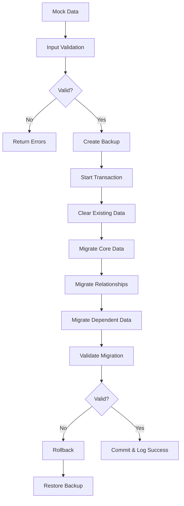

# Data Migration System

This document describes the data migration system for migrating mock data from the frontend to the PostgreSQL database.

## Overview

The data migration system provides a robust, reliable way to transfer existing mock data from the React frontend to the backend database. It includes comprehensive validation, error handling, rollback mechanisms, and monitoring.

## Features

- **Comprehensive Validation**: Input data validation and referential integrity checks
- **Atomic Transactions**: All-or-nothing migration using database transactions
- **Backup & Rollback**: Automatic backup creation with rollback capabilities
- **Detailed Logging**: Complete audit trail of migration operations
- **Error Handling**: Graceful error handling with detailed error reporting
- **Testing Suite**: Comprehensive test coverage for various migration scenarios
- **Performance Monitoring**: Migration timing and performance metrics

## Quick Start

### Prerequisites

1. Ensure PostgreSQL database is running and accessible
2. Run database migrations: `npm run db:migrate`
3. Generate Prisma client: `npm run db:generate`

### Basic Migration

```bash
# Run the complete data migration
npm run db:migrate-data

# Test the migration system
npm run db:test-migration

# Run migration tests
npm run migration:test
```

## Migration Process

### 1. Data Validation

Before migration begins, the system validates:

- **Required Fields**: Ensures all mandatory fields are present
- **Data Types**: Validates data type consistency
- **Email Formats**: Validates email address formats
- **Referential Integrity**: Checks foreign key relationships
- **Business Rules**: Validates business logic constraints (e.g., positive capacity)

### 2. Backup Creation

Before any data changes, the system:

- Creates a timestamped backup of current database state
- Generates checksums for data integrity verification
- Stores backups in the `backups/` directory

### 3. Migration Execution

The migration process:

- Clears existing data in dependency order
- Creates a default system user
- Migrates core entities (students, classes)
- Migrates relationships (enrollments)
- Migrates dependent data (schedules, tests, etc.)
- Validates final state

### 4. Validation & Monitoring

After migration:

- Performs referential integrity checks
- Validates data counts and relationships
- Logs detailed migration summary
- Reports performance metrics

## Data Flow



## API Reference

### DataMigrationService

#### `migrateAllData(mockData: MockData): Promise<MigrationResult>`

Performs complete data migration from mock data to database.

**Parameters:**
- `mockData`: Complete mock data object containing all entities

**Returns:**
- `MigrationResult`: Object containing success status, message, and summary

**Example:**
```typescript
const migrationService = new DataMigrationService()
const result = await migrationService.migrateAllData(mockData)

if (result.success) {
  console.log('Migration completed:', result.summary)
} else {
  console.error('Migration failed:', result.errors)
}
```

#### `validateMigration(): Promise<boolean>`

Validates the integrity of migrated data.

**Returns:**
- `boolean`: True if validation passes, false otherwise

#### `rollback(backupId: string): Promise<void>`

Rolls back database to a previous backup state.

**Parameters:**
- `backupId`: ID of the backup to restore

#### `testMigration(): Promise<{success: boolean, results: any[]}>`

Runs comprehensive migration tests with various data scenarios.

## Error Handling

### Validation Errors

Input validation errors are returned with detailed information:

```typescript
interface ValidationError {
  entity: string    // Entity type (e.g., 'student', 'class')
  id: string       // Entity ID
  field: string    // Field name with error
  message: string  // Error description
}
```

### Migration Errors

Migration errors trigger automatic rollback when possible:

- **Database Errors**: Connection issues, constraint violations
- **Validation Failures**: Data integrity issues
- **System Errors**: File system, memory issues

### Rollback Process

When migration fails:

1. System attempts automatic rollback to pre-migration state
2. Backup is restored using database transaction
3. Error details are logged for investigation
4. User is notified of rollback completion

## Backup System

### Backup Creation

Backups are automatically created before each migration:

- **Location**: `backups/backup-{timestamp}.json`
- **Format**: JSON with complete database state
- **Integrity**: SHA-256 checksums for verification
- **Retention**: Manual cleanup (consider implementing automatic cleanup)

### Backup Structure

```typescript
interface MigrationBackup {
  timestamp: string    // ISO timestamp
  data: any           // Complete database export
  checksum: string    // Data integrity checksum
}
```

### Manual Rollback

To manually rollback to a specific backup:

```bash
# List available backups
ls backups/

# Rollback to specific backup
tsx -e "
import { DataMigrationService } from './src/services/dataMigrationService';
const service = new DataMigrationService();
service.rollback('backup-2024-12-14T10-30-00-000Z').then(() => console.log('Rollback complete'));
"
```

## Logging

### Log Locations

- **Migration Logs**: `logs/migration.log`
- **Console Output**: Real-time progress updates
- **Test Logs**: Included in test output

### Log Format

```
[2024-12-14T10:30:00.000Z] 🚀 Starting complete data migration...
[2024-12-14T10:30:01.000Z] 📦 Created backup: backup-2024-12-14T10-30-00-000Z
[2024-12-14T10:30:02.000Z] 🧹 Cleared existing data
[2024-12-14T10:30:03.000Z] ✅ Migrated 6 students
[2024-12-14T10:30:04.000Z] ✅ Migrated 7 classes
[2024-12-14T10:30:05.000Z] ✅ Data migration completed successfully in 5000ms
```

## Testing

### Test Categories

1. **Unit Tests**: Individual method testing
2. **Integration Tests**: End-to-end migration scenarios
3. **Validation Tests**: Data validation logic
4. **Error Handling Tests**: Failure scenarios
5. **Performance Tests**: Migration timing and resource usage

### Running Tests

```bash
# Run all migration tests
npm run migration:test

# Run with coverage
npm run migration:test -- --coverage

# Run specific test file
npm test -- dataMigrationService.test.ts

# Run in watch mode
npm run test:watch -- dataMigrationService.test.ts
```

### Test Data

Tests use isolated test data to avoid conflicts:

- **Test Database**: Separate from development/production
- **Mock Data**: Comprehensive test scenarios
- **Cleanup**: Automatic cleanup between tests

## Performance Considerations

### Optimization Strategies

1. **Batch Processing**: Large datasets processed in batches
2. **Transaction Management**: Efficient transaction boundaries
3. **Index Usage**: Proper database indexing for performance
4. **Memory Management**: Streaming for large data sets

### Monitoring

The system tracks:

- **Migration Duration**: Total time for complete migration
- **Entity Counts**: Number of records migrated per entity type
- **Memory Usage**: Peak memory consumption during migration
- **Database Performance**: Query execution times

### Performance Targets

- **Small Dataset** (< 1000 records): < 5 seconds
- **Medium Dataset** (1000-10000 records): < 30 seconds
- **Large Dataset** (> 10000 records): < 2 minutes

## Troubleshooting

### Common Issues

#### Migration Fails with Validation Errors

**Symptoms**: Migration returns validation errors
**Solution**: 
1. Check input data format and required fields
2. Verify email formats and data types
3. Ensure referential integrity (IDs exist)

#### Database Connection Issues

**Symptoms**: Connection timeout or refused
**Solution**:
1. Verify DATABASE_URL environment variable
2. Check PostgreSQL service status
3. Verify network connectivity and credentials

#### Rollback Fails

**Symptoms**: Rollback operation fails
**Solution**:
1. Check backup file integrity
2. Verify database permissions
3. Ensure sufficient disk space

#### Performance Issues

**Symptoms**: Migration takes too long
**Solution**:
1. Check database performance and indexing
2. Monitor system resources (CPU, memory)
3. Consider batch size optimization

### Debug Mode

Enable detailed debugging:

```bash
# Set debug environment variable
DEBUG=migration:* npm run db:migrate-data

# Or use verbose logging
MIGRATION_LOG_LEVEL=debug npm run db:migrate-data
```

### Support

For additional support:

1. Check migration logs in `logs/migration.log`
2. Review backup files in `backups/` directory
3. Run migration tests to isolate issues
4. Check database logs for constraint violations

## Security Considerations

### Data Protection

- **Backup Security**: Backups contain sensitive data - secure storage required
- **Log Sanitization**: Ensure logs don't contain sensitive information
- **Access Control**: Restrict migration script access to authorized users

### Best Practices

1. **Environment Separation**: Never run migration against production without testing
2. **Backup Verification**: Always verify backup integrity before migration
3. **Access Logging**: Log all migration operations for audit trail
4. **Data Validation**: Validate all input data before processing

## Future Enhancements

### Planned Features

1. **Incremental Migration**: Support for partial data updates
2. **Schema Versioning**: Handle database schema changes
3. **Parallel Processing**: Multi-threaded migration for large datasets
4. **Real-time Monitoring**: Live migration progress dashboard
5. **Automated Cleanup**: Automatic backup retention policies

### Configuration Options

Future configuration options may include:

- **Batch Sizes**: Configurable batch processing sizes
- **Timeout Settings**: Customizable operation timeouts
- **Retry Logic**: Automatic retry for transient failures
- **Notification System**: Email/Slack notifications for migration status